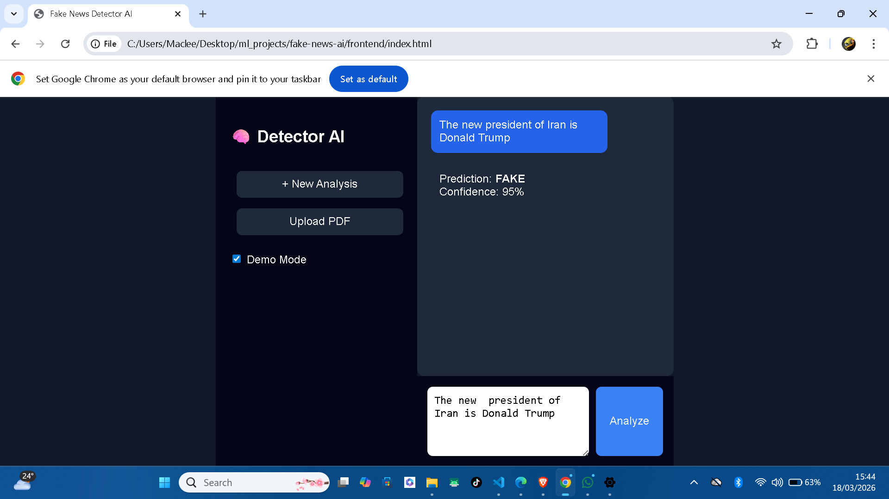

# Fake News Detector AI

Detect fake news articles with a simple web interface powered by a Python AI model. Paste any news article or upload a text file, click **Analyze**, and get an instant prediction with a confidence score.

---

## Live Demo / Screenshots

For portfolio purposes, there’s a **demo mode** that can show a sample prediction (e.g., FAKE with 95% confidence) even without running the model.

---

## Features

- Text Input & PDF Upload
- Real-Time Prediction (FastAPI + Transformers)
- Demo Mode for quick portfolio screenshots
- Clean Chat UI

---

## Getting Started (PowerShell Commands)

# Clone repo if needed
git clone git@github.com:MacleeDev/fake-news-detector.git
cd fake-news-detector

# Folder structure
screenshots/
backend/models/
js/
css/

# Virtual environment
python -m venv .venv
.venv\Scripts\Activate.ps1

# Install backend dependencies
pip install -r backend/requirements.txt

# Start backend
cd backend
uvicorn app.main:app --reload

# Open frontend
Start-Process "..\index.html"

---

## File Structure

---

## Portfolio Use

1. Open index.html.
2. Check Demo Mode.
3. Paste fake news ? Analyze ? screenshot.
4. Uncheck Demo Mode for real predictions.

---

## License

MIT License
